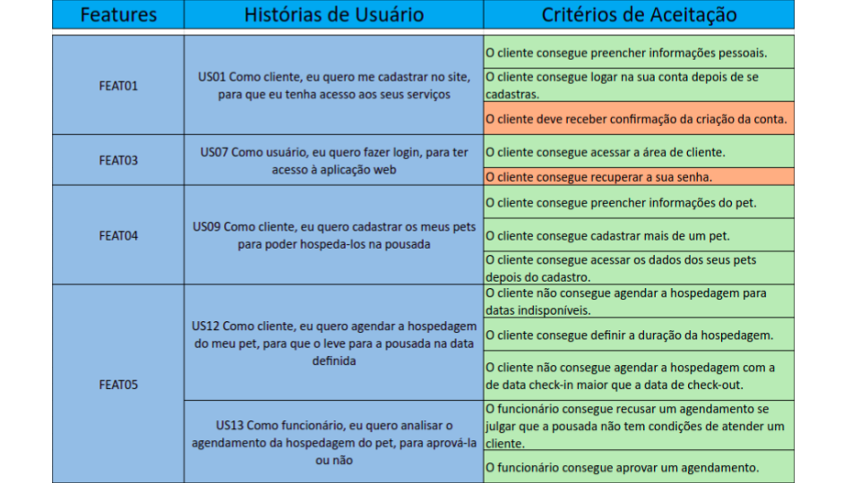

# Mínimo Produto Viável - Entrega Parcial

## Histórico de revisão
| Data       | Autor                                        | Modificações                      | Versão |
| ---------- | -------------------------------------------- | --------------------------------- | ------ |
| 05/04/2022 | [Ana Júlia](https://github.com/aluzianobriceno) | Cria documento para entrega da unidade 4 | 1.0 |

## MVP Concluído

Aqui apresentamos o nosso MVP parcial. Onde explicitamos quais features > histórias de usuário foram concluídas até o presente momento, assim como seus critérios aceitação.

Os critérios de aceitção em vermelho não foram concluídos.