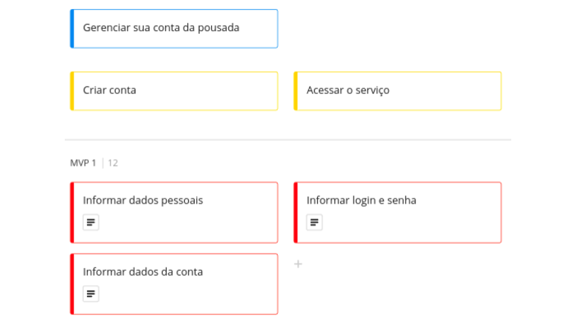
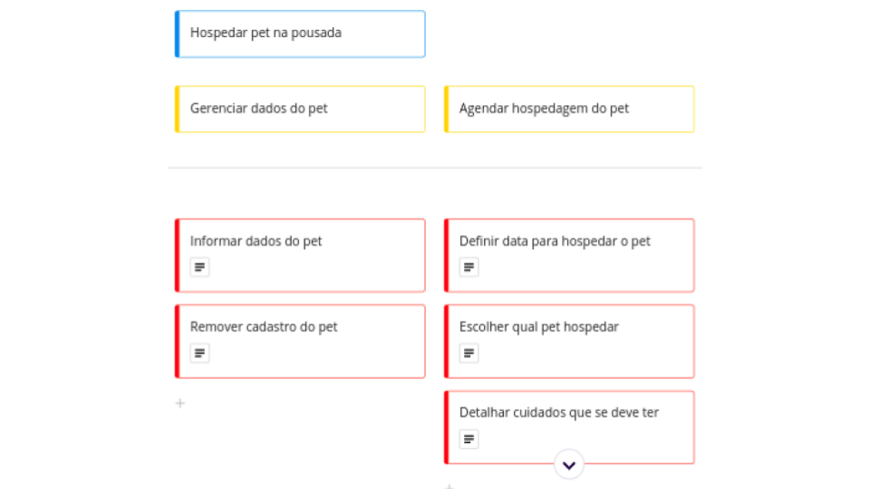
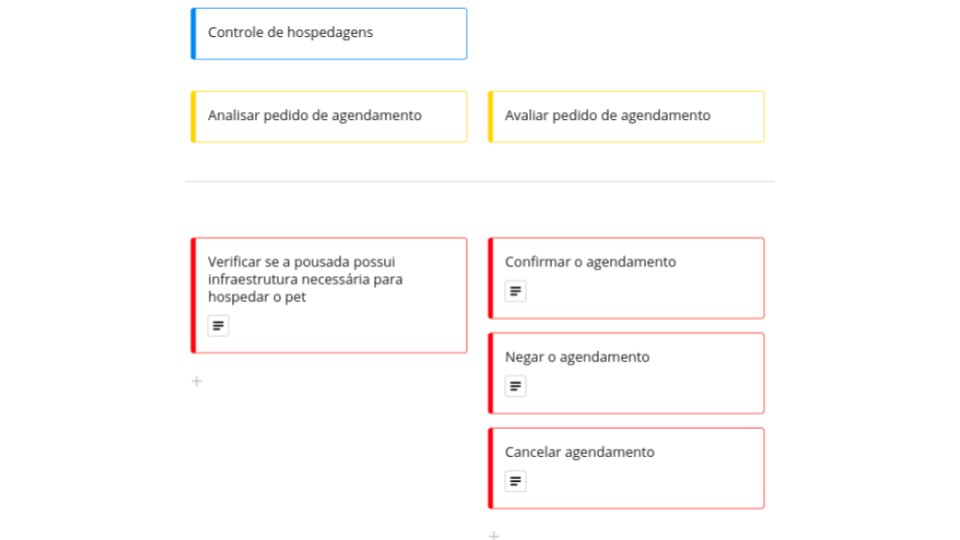
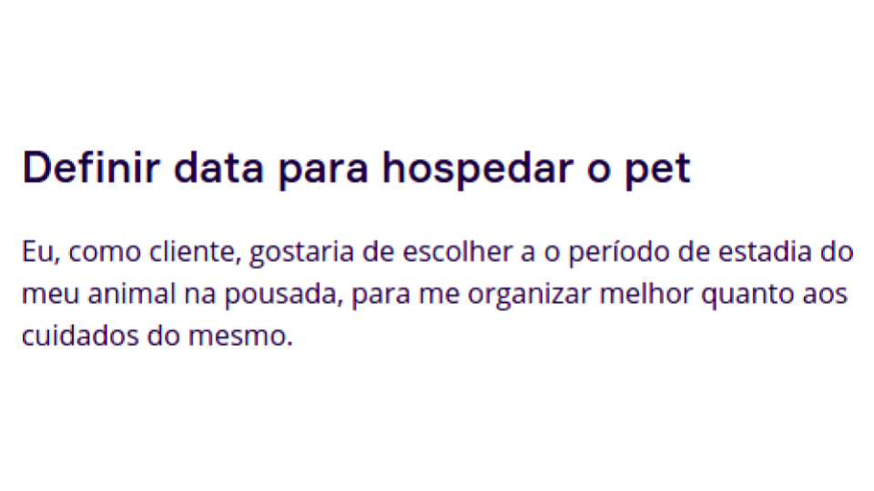

# User Story Map

## Histórico de revisão
| Data       | Autor                                        | Modificações                      | Versão |
| ---------- | -------------------------------------------- | --------------------------------- | ------ |
| 05/04/2022 | [Ana Júlia](https://github.com/aluzianobriceno) | Cria documento para entrega da unidade 4 | 1.0 |
| 08/04/2022 | [Ana Júlia](https://github.com/aluzianobriceno) | Atualiza imagens | 1.1 |

## Mapa de histórias
Acompanhe a explicação pelo [Miro](https://miro.com/app/board/uXjVOU3NO04=/?invite_link_id=708110023975)

### Primeira etapa
* Definição dos objetivos do cliente
* Definição da Jornada do cliente
* Definição do MVP

### Segunda etapa
* Definição dos objetivos do funcionário
* Definição da jornada do funcionário
* Definir histórias de usuário
* Dividir o MVP em dois.

### Objetivos do Usuário

#### Amostra do Mapa de Histórias da parte comum entre cliente e funcionário

    

 

Veja mais pelo [Miro](https://miro.com/app/board/uXjVOU3NO04=/?invite_link_id=708110023975)

#### Amostra do Mapa de Histórias do cliente

    

 

Veja mais pelo [Miro](https://miro.com/app/board/uXjVOU3NO04=/?invite_link_id=708110023975)

#### Amostra do Mapa de Histórias do funcionário

    

 

Veja mais pelo [Miro](https://miro.com/app/board/uXjVOU3NO04=/?invite_link_id=708110023975)

#### Amostra de Histórias de Usuário

Para cada tarefa de usuário temos uma história de usuário.

    

 

Veja mais pelo [Miro](https://miro.com/app/board/uXjVOU3NO04=/?invite_link_id=708110023975)