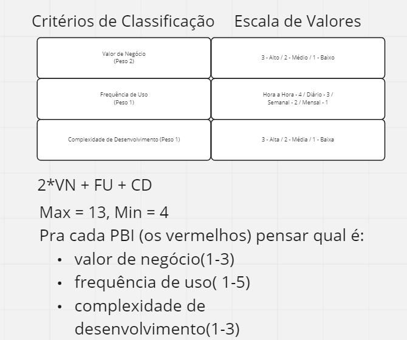
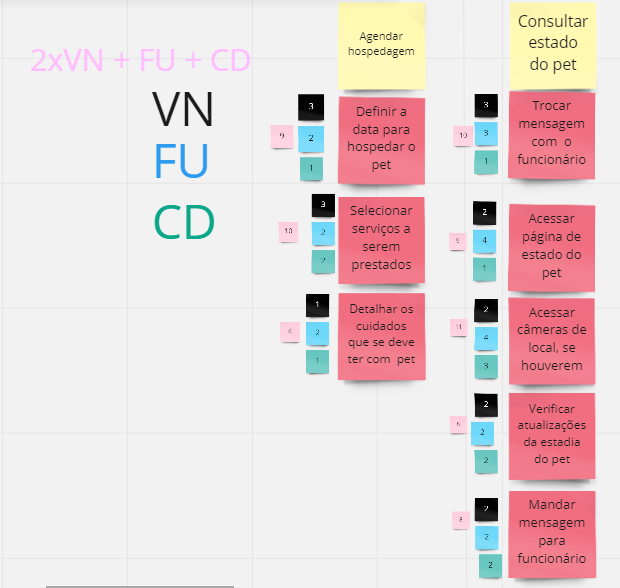
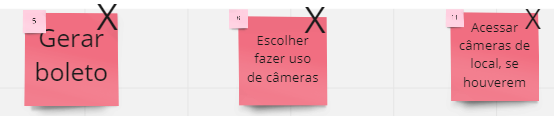
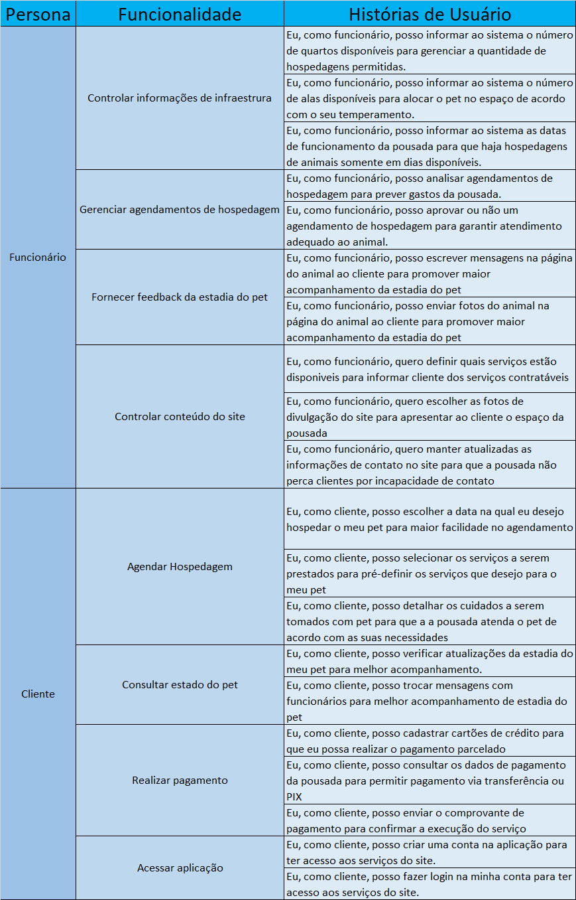
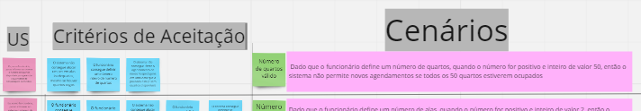

# PBB - Product Backlog Building

## Histórico de revisão

| Data       | Autor                                        | Modificações                      | Versão |
| ---------- | -------------------------------------------- | --------------------------------- | ------ |
| 17/03/2022 | [Luís Lins](https://github.com/luisgaboardi), [Lais Portela](https://github.com/lais3722@gmail.com), [Kathlyn Lara](https://github.com/klmurussi@hotmail.com) | Adiciona primeira versão do PBB, histórias de usuário e BDD, unidade 3 | 1.0 |
| 24/04/2022 | [Laís Portela](https://github.com/laispa) | Versão final do documento do PBB| 2.0 |

## PBB
Acompanhe a explicação pelo [Miro](https://miro.com/welcomeonboard/MTJXS1NoUXlSYW9ueG1hNDZwV2VmTHdhSE05VWRybHFRbE5BRXM5YVBTbnJsbkREMWdzdHVjS25mQlRPWUg0Q3wzNDU4NzY0NTE2ODYwMTczNjQx?invite_link_id=424579723050)

### Primeira versão
* Definição dos problemas
* Definição das expectativas
* Definição das personas
* Definição das funcionalidades
* Definição dos PBIs

### Segunda versão

#### Priorização dos PBIs
Os PBIs foram priorizados de acordo com 3 critérios:
* Valor de negócio
* Frequência de Uso
* Complexidade

A escala de valores e a fórmula para o valor final constam na imagem abaixo:

  

A priorização dos PBIs teve como resultado:

  

Veja mais pelo [Miro](https://miro.com/welcomeonboard/MTJXS1NoUXlSYW9ueG1hNDZwV2VmTHdhSE05VWRybHFRbE5BRXM5YVBTbnJsbkREMWdzdHVjS25mQlRPWUg0Q3wzNDU4NzY0NTE2ODYwMTczNjQx?invite_link_id=424579723050)

#### PBB Canvas
Para visualizar a versão priorizada do PBB Canvas, observar a diagrama com o seguinte título:

  

Observe que foram despriorizadas 3 PBIs:

  

#### Histórias de Usuário

  

#### Critérios de Aceitação

  

  

  

  

  

#### BDD - Behavior Driven Development
Para visualizar o BDD completo, observar o diagrama com a seguinte aparência no [Miro](https://miro.com/welcomeonboard/MTJXS1NoUXlSYW9ueG1hNDZwV2VmTHdhSE05VWRybHFRbE5BRXM5YVBTbnJsbkREMWdzdHVjS25mQlRPWUg0Q3wzNDU4NzY0NTE2ODYwMTczNjQx?invite_link_id=424579723050)

  

